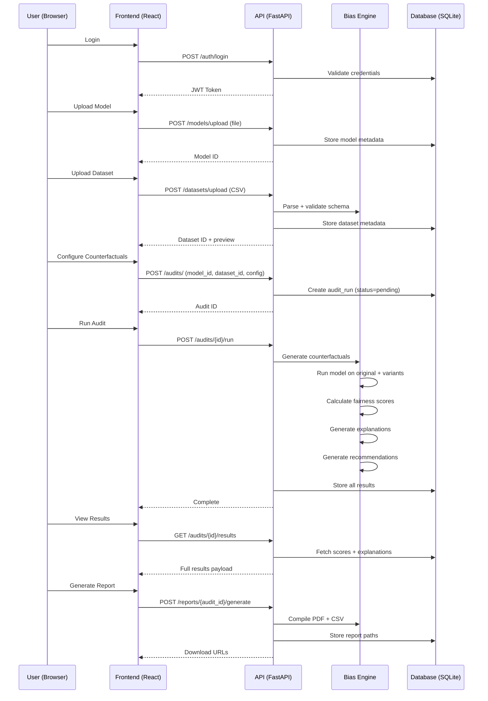

# AI Bias & Fairness Auditor — Implementation Plan

## Goal

Build a hackathon-ready, production-structured full-stack system that detects, measures, and explains bias in AI model outputs using counterfactual testing. The system will be runnable locally with a React frontend, FastAPI backend, SQLite database (local MVP), and a custom ML bias engine.

> [!IMPORTANT]
> **MVP Scope**: We're building a working demo, not a production deployment. Google OAuth will be a placeholder (mock auth), Supabase is replaced with SQLite for zero-config local dev, and we'll use a mock ML model for demo purposes.

---

## User Review Required

> [!WARNING]
> **Database Choice**: The PRD specifies Supabase/PostgreSQL. For a hackathon-ready local demo, I'll use **SQLite** via SQLAlchemy so there's zero external dependency. The schema is identical — migrating to PostgreSQL/Supabase later is a one-line config change. **Is this acceptable?**

> [!WARNING]
> **Authentication**: Google OAuth requires a GCP project + credentials. For MVP, I'll implement a **mock auth system** (email/password with JWT tokens) with the Google OAuth flow stubbed out and ready to plug in. **Is this acceptable?**

> [!IMPORTANT]
> **Frontend Framework**: The PRD says ReactJS. I'll use **Vite + React** for fast dev server and modern tooling. This is standard React — no deviation from the PRD.

---

## Open Questions

1. **Demo Data**: Should I include a pre-built demo dataset (e.g., a fake loan application dataset) so the system can be demonstrated immediately without uploading files?
2. **Model Upload**: For the hackathon demo, should we support actual pickle model loading, or is a built-in mock model sufficient?
3. **PDF Generation**: ReportLab requires a separate install. Should I include it in MVP, or is a downloadable HTML/CSV report sufficient?

---

## Project Structure

```
d:\Personal_projects\Detect_bias\
├── backend/
│   ├── app/
│   │   ├── __init__.py
│   │   ├── main.py                    # FastAPI app entry point
│   │   ├── config.py                  # App configuration
│   │   ├── database.py                # SQLAlchemy setup
│   │   ├── models/                    # SQLAlchemy ORM models
│   │   │   ├── __init__.py
│   │   │   ├── user.py
│   │   │   ├── model.py
│   │   │   ├── dataset.py
│   │   │   ├── audit_run.py
│   │   │   ├── fairness_score.py
│   │   │   ├── bias_explanation.py
│   │   │   ├── mitigation.py
│   │   │   └── audit_report.py
│   │   ├── schemas/                   # Pydantic request/response schemas
│   │   │   ├── __init__.py
│   │   │   ├── user.py
│   │   │   ├── model.py
│   │   │   ├── dataset.py
│   │   │   ├── audit.py
│   │   │   └── report.py
│   │   ├── routers/                   # API route handlers
│   │   │   ├── __init__.py
│   │   │   ├── auth.py
│   │   │   ├── models.py
│   │   │   ├── datasets.py
│   │   │   ├── audits.py
│   │   │   └── reports.py
│   │   ├── services/                  # Business logic layer
│   │   │   ├── __init__.py
│   │   │   ├── auth_service.py
│   │   │   ├── model_service.py
│   │   │   ├── dataset_service.py
│   │   │   ├── audit_service.py
│   │   │   └── report_service.py
│   │   └── middleware/
│   │       ├── __init__.py
│   │       └── auth_middleware.py
│   ├── bias_engine/                   # Core ML/Bias detection module
│   │   ├── __init__.py
│   │   ├── counterfactual.py          # Counterfactual generator
│   │   ├── detector.py                # Bias detection engine
│   │   ├── scorer.py                  # Fairness scoring (DIRatio etc.)
│   │   ├── explainer.py               # Plain-language explanation generator
│   │   ├── recommender.py             # Mitigation recommendations
│   │   └── mock_model.py              # Demo mock model for testing
│   ├── uploads/                       # Uploaded models & datasets
│   │   ├── models/
│   │   └── datasets/
│   ├── reports/                       # Generated PDF/CSV reports
│   ├── requirements.txt
│   └── run.py                         # Dev server launcher
├── frontend/
│   ├── public/
│   ├── src/
│   │   ├── main.jsx
│   │   ├── App.jsx
│   │   ├── App.css
│   │   ├── index.css                  # Global design system
│   │   ├── api/
│   │   │   └── client.js              # Axios API client
│   │   ├── context/
│   │   │   └── AuthContext.jsx        # Auth state management
│   │   ├── components/
│   │   │   ├── Layout/
│   │   │   │   ├── Navbar.jsx
│   │   │   │   ├── Sidebar.jsx
│   │   │   │   └── Layout.jsx
│   │   │   ├── Dashboard/
│   │   │   │   ├── StatsCard.jsx
│   │   │   │   └── RecentAudits.jsx
│   │   │   ├── Upload/
│   │   │   │   ├── ModelUpload.jsx
│   │   │   │   └── DatasetUpload.jsx
│   │   │   ├── Audit/
│   │   │   │   ├── CounterfactualConfig.jsx
│   │   │   │   ├── AuditProgress.jsx
│   │   │   │   └── FairnessGauge.jsx
│   │   │   ├── Results/
│   │   │   │   ├── FairnessScoreCard.jsx
│   │   │   │   ├── BiasExplanation.jsx
│   │   │   │   ├── MitigationCard.jsx
│   │   │   │   └── BiasChart.jsx
│   │   │   └── Reports/
│   │   │       ├── ReportList.jsx
│   │   │       └── ReportDetail.jsx
│   │   ├── pages/
│   │   │   ├── LoginPage.jsx
│   │   │   ├── DashboardPage.jsx
│   │   │   ├── UploadModelPage.jsx
│   │   │   ├── UploadDatasetPage.jsx
│   │   │   ├── ConfigCounterfactualPage.jsx
│   │   │   ├── AuditProgressPage.jsx
│   │   │   ├── ResultsDashboardPage.jsx
│   │   │   ├── ExplanationsPage.jsx
│   │   │   ├── MitigationsPage.jsx
│   │   │   ├── ReportsPage.jsx
│   │   │   └── ReportDetailPage.jsx
│   │   └── utils/
│   │       └── helpers.js
│   ├── index.html
│   ├── vite.config.js
│   └── package.json
├── database/
│   └── schema.sql                     # Full SQL schema
├── demo/
│   ├── sample_dataset.csv             # Pre-built demo dataset
│   └── README.md                      # Demo instructions
└── README.md
```

---

## Proposed Changes

### Phase 1: Backend Foundation

#### [NEW] [requirements.txt](file:///d:/Personal_projects/Detect_bias/backend/requirements.txt)
Dependencies: `fastapi`, `uvicorn`, `sqlalchemy`, `pydantic`, `python-jose[cryptography]`, `passlib[bcrypt]`, `python-multipart`, `pandas`, `numpy`, `aiofiles`, `reportlab`

#### [NEW] [run.py](file:///d:/Personal_projects/Detect_bias/backend/run.py)
Uvicorn dev server launcher with auto-reload

#### [NEW] [config.py](file:///d:/Personal_projects/Detect_bias/backend/app/config.py)
App settings: JWT secret, upload paths, DB URL, CORS origins

#### [NEW] [database.py](file:///d:/Personal_projects/Detect_bias/backend/app/database.py)
SQLAlchemy engine + session factory. SQLite for MVP, swappable to PostgreSQL.

#### [NEW] [main.py](file:///d:/Personal_projects/Detect_bias/backend/app/main.py)
FastAPI app with CORS, router registration, startup/shutdown events, and DB table creation.

---

### Phase 2: Database Models & Schemas

#### [NEW] ORM Models (`backend/app/models/`)
All 8 tables from the PRD converted to SQLAlchemy models:
- `user.py` — User with role enum (admin/user)
- `model.py` — Uploaded AI models metadata
- `dataset.py` — Uploaded datasets with schema JSON
- `audit_run.py` — Audit execution tracking with status
- `fairness_score.py` — Per-dimension fairness scores
- `bias_explanation.py` — Generated explanations with severity
- `mitigation.py` — Ranked recommendations
- `audit_report.py` — Generated report file paths

#### [NEW] Pydantic Schemas (`backend/app/schemas/`)
Request/response models for all API endpoints with validation.

#### [NEW] [schema.sql](file:///d:/Personal_projects/Detect_bias/database/schema.sql)
Raw SQL DDL for PostgreSQL compatibility (for future Supabase migration).

---

### Phase 3: API Endpoints & Services

#### [NEW] Auth Router (`backend/app/routers/auth.py`)
- `POST /api/auth/register` — Create account (admin/user)
- `POST /api/auth/login` — JWT token generation
- `GET /api/auth/me` — Get current user
- `POST /api/auth/google` — Google OAuth placeholder

#### [NEW] Models Router (`backend/app/routers/models.py`)
- `POST /api/models/upload` — Upload model file (pkl/h5/API URL)
- `GET /api/models/` — List user's models
- `GET /api/models/{id}` — Get model details
- `DELETE /api/models/{id}` — Remove model

#### [NEW] Datasets Router (`backend/app/routers/datasets.py`)
- `POST /api/datasets/upload` — Upload CSV/JSON dataset
- `GET /api/datasets/` — List datasets
- `GET /api/datasets/{id}` — Dataset details + preview
- `GET /api/datasets/{id}/preview` — First 5 rows preview

#### [NEW] Audits Router (`backend/app/routers/audits.py`)
- `POST /api/audits/` — Create new audit run
- `POST /api/audits/{id}/configure` — Set counterfactual config
- `POST /api/audits/{id}/run` — Execute bias detection (async)
- `GET /api/audits/{id}/status` — Poll execution status
- `GET /api/audits/{id}/results` — Get fairness scores + explanations
- `GET /api/audits/` — List all audits

#### [NEW] Reports Router (`backend/app/routers/reports.py`)
- `POST /api/reports/{audit_id}/generate` — Generate PDF + CSV
- `GET /api/reports/` — List all reports
- `GET /api/reports/{id}/download/pdf` — Download PDF
- `GET /api/reports/{id}/download/csv` — Download CSV

#### [NEW] Service Layer (`backend/app/services/`)
Business logic separated from route handlers. Each service handles validation, DB operations, and bias engine orchestration.

---

### Phase 4: ML Bias Engine (Core Logic)

This is the heart of the system. All modules in `backend/bias_engine/`.

#### [NEW] [counterfactual.py](file:///d:/Personal_projects/Detect_bias/backend/bias_engine/counterfactual.py)
**Counterfactual Generator** — Generates demographic variations of input data:
- **Gender swap**: `he→she`, `him→her`, `male→female`, male↔female names
- **Name/Caste swap**: Dictionary of high-caste ↔ low-caste Indian names
- **Language indicator**: Adds language markers to text fields
- **Region swap**: North ↔ South Indian location references
- Strategies: `systematic` (one-at-a-time), `random`, `exhaustive`
- Returns DataFrame of original↔counterfactual pairs

#### [NEW] [detector.py](file:///d:/Personal_projects/Detect_bias/backend/bias_engine/detector.py)
**Bias Detection Engine** — Runs the model on original + counterfactual inputs:
- Feeds both versions through the model
- Computes per-pair output difference `|A - B|`
- Aggregates differences per demographic dimension
- Flags dimensions with significant disparities

#### [NEW] [scorer.py](file:///d:/Personal_projects/Detect_bias/backend/bias_engine/scorer.py)
**Fairness Scorer** — Calculates normalized fairness metrics:
- Disparate Impact Ratio (DIRatio)
- Demographic Parity difference
- Fairness Score = `1 - |DIRatio - 1.0|` (clamped 0-1)
- Classification: Fair (≥0.8), Review (0.5-0.8), Biased (<0.5)

#### [NEW] [explainer.py](file:///d:/Personal_projects/Detect_bias/backend/bias_engine/explainer.py)
**Explanation Generator** — Template-based plain-language explanations:
- Bias magnitude and direction
- Affected demographic group
- Likely root cause (training data, feature correlation)
- Severity assessment (LOW/MEDIUM/HIGH)
- Legal/ethical implications

#### [NEW] [recommender.py](file:///d:/Personal_projects/Detect_bias/backend/bias_engine/recommender.py)
**Mitigation Recommender** — Rule-based recommendation engine:
- Data-level fixes (collect balanced data, re-weight, augment)
- Feature-level fixes (remove proxies, fairness constraints)
- Output-level fixes (threshold adjustment, post-processing)
- Model-level fixes (adversarial debiasing, fairness loss)
- Each recommendation has effort/impact scores

#### [NEW] [mock_model.py](file:///d:/Personal_projects/Detect_bias/backend/bias_engine/mock_model.py)
**Demo Mock Model** — A deliberately biased loan approval model:
- Takes features: name, gender, income, credit_score, region
- Introduces controlled bias: lower scores for female names, certain castes, southern regions
- Used for demo/testing — produces visually clear bias results

---

### Phase 5: Frontend (React + Vite)

#### [NEW] Design System (`frontend/src/index.css`)
Premium dark-mode design system with:
- CSS custom properties for colors, spacing, typography
- Glassmorphism cards, gradient accents
- Smooth transitions and micro-animations
- Google Font: Inter

#### [NEW] Pages (11 pages total)
| Page | Route | Purpose |
|------|-------|---------|
| LoginPage | `/login` | Auth with Google OAuth mock |
| DashboardPage | `/` | Overview: recent audits, quick stats |
| UploadModelPage | `/upload/model` | Model file upload with validation |
| UploadDatasetPage | `/upload/dataset` | Dataset upload + schema preview |
| ConfigCounterfactualPage | `/audit/configure` | Select dimensions + strategy |
| AuditProgressPage | `/audit/progress/:id` | Real-time progress bar |
| ResultsDashboardPage | `/audit/results/:id` | Fairness scores + charts |
| ExplanationsPage | `/audit/explanations/:id` | Per-dimension bias explanations |
| MitigationsPage | `/audit/mitigations/:id` | Ranked fix recommendations |
| ReportsPage | `/reports` | List all audit reports |
| ReportDetailPage | `/reports/:id` | Single report view + download |

#### [NEW] Key Components
- **FairnessGauge** — Animated circular gauge showing 0-1 score with color coding
- **BiasChart** — Bar chart showing prediction differences per dimension
- **FairnessScoreCard** — Card with dimension name, score, status icon
- **AuditProgress** — Animated progress bar with status text
- **ModelUpload / DatasetUpload** — Drag-and-drop file upload with validation

#### [NEW] API Client (`frontend/src/api/client.js`)
Axios instance with JWT auth headers, base URL config, interceptors.

#### [NEW] Auth Context (`frontend/src/context/AuthContext.jsx`)
React context for auth state: login/logout, token storage, user role.

---

### Phase 6: Demo Data & Documentation

#### [NEW] [sample_dataset.csv](file:///d:/Personal_projects/Detect_bias/demo/sample_dataset.csv)
Pre-built loan application dataset with ~200 rows containing:
- `name`, `gender`, `age`, `income`, `credit_score`, `region`, `loan_amount`, `approved` (label)
- Deliberately balanced so the mock model's bias is clearly visible

#### [NEW] [README.md](file:///d:/Personal_projects/Detect_bias/README.md)
Project overview, setup instructions, demo walkthrough.

---

## End-to-End Data Flow



---

## Verification Plan

### Automated Tests
1. **Backend startup**: `python run.py` launches without errors
2. **Frontend startup**: `npm run dev` serves the React app
3. **API smoke test**: `curl` all endpoints and verify 200/401 responses
4. **Bias engine unit test**: Run counterfactual generator on sample data, verify output shape
5. **End-to-end demo**: Upload sample dataset → run audit → view results → download report

### Manual Verification
1. Open browser → Login → Navigate through all pages
2. Upload the demo dataset → Configure counterfactuals → Run audit
3. Verify fairness scores display correctly with color coding
4. Verify explanations are readable and accurate
5. Download PDF/CSV report and verify contents
6. Record browser session as demo video

---

## Build Order

| Step | What | Est. Time |
|------|------|-----------|
| 1 | Backend foundation (FastAPI + DB + config) | 15 min |
| 2 | Database models + schemas | 10 min |
| 3 | Bias Engine (counterfactual + detector + scorer + explainer + recommender) | 20 min |
| 4 | API routers + services (auth, upload, audit, reports) | 20 min |
| 5 | Frontend scaffold (Vite + React + routing + design system) | 10 min |
| 6 | Frontend pages (Login, Dashboard, Upload, Config, Results, Reports) | 30 min |
| 7 | Demo data + integration testing | 10 min |
| 8 | Polish + documentation | 10 min |

**Total estimated: ~2 hours**
